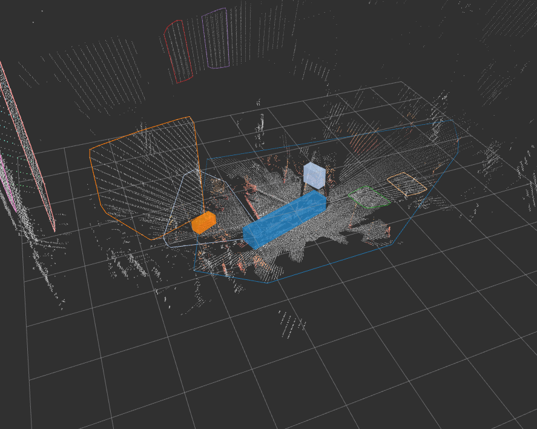

# About This Package
This package is tutorial for my deeper understanding pcl_ros.

## extracting_indices
Extract plane and generate new pcd in current directory.
```bash
rosrun my_pcl_ros_tutorial extracting_indices <file name>
rosrun my_pcl_ros_tutorial extracting_indices $(rospack find my_pcl_ros_tutorial)/data/table_scene_lms400.pcd
```

You can check the pcd file by following commands:
```bash
pcl_viewer table_scene_lms400_plane_0.pcd
```

# Sample
## Detect Trass
First, launch `trass_detection.launch`.
```
roslaunch my_pcl_ros_tutorial trass_detection.launch
```

Second, check the results.
```
rosrun rviz rviz -d $(rospack find my_pcl_ros_tutorial)/config/trass_detection.rviz
```
You'll find that trass is detected as blue bounding box as follows:

